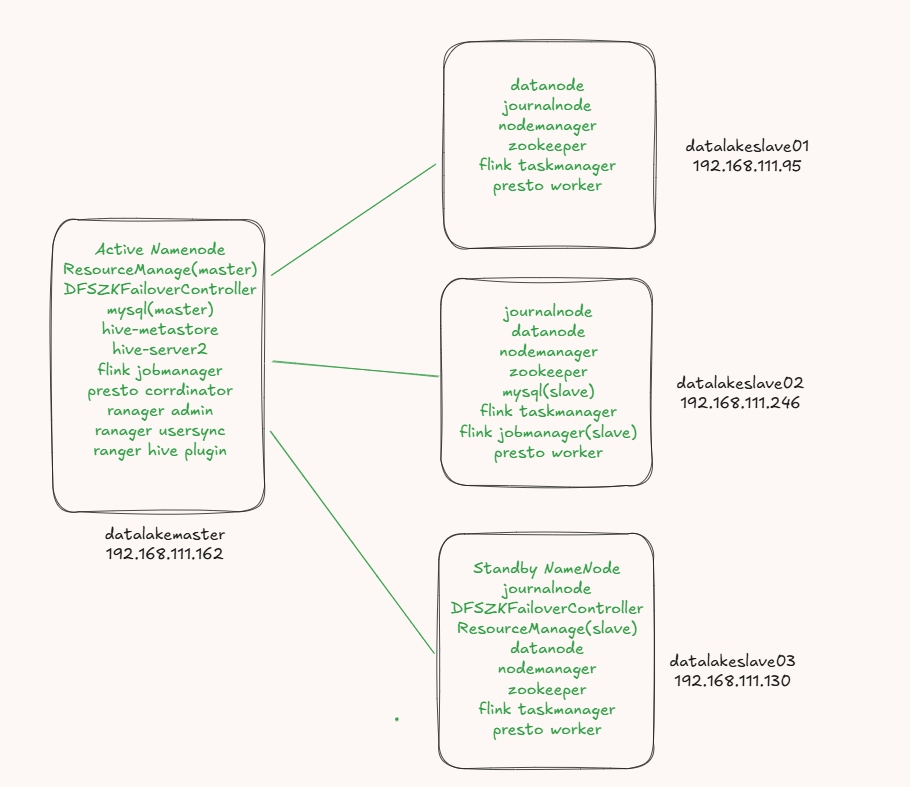

### 组件包和部分依赖
- flink-1.17.2-bin-scala_2.12.tgz
- hadoop-3.1.2.tar.gz
- apache-hive-3.1.2-bin.tar.gz
- mysql-5.7.35-linux-glibc2.12-x86_64.tar.gz
- presto-server-0.286.tar.gz
- ranger-2.1.0-admin.tar.gz
- ranger-2.1.0-usersync.tar.gz
- ranger-2.1.0-hive-plugin.tar.gz
- spark-3.3.4-bin-hadoop3.tgz
- apache-zookeeper-3.6.3-bin.tar.gz
- jdk-8u162-linux-x64.tar.gz
- iceberg-spark-runtime-3.3_2.12-1.4.3.jar
- mysql-connector-java-5.1.35-bin.jar

### 部署架构

### Quest
1. 各服务器必须同步时间 分布式系统对这块敏感 不同步可能造成数据不一致和影响分布式系统故障处理
2. 除了做root用户免密之外还要做hadoop用户的免密,因为hadoop集群会使用sshfence远程的方式解脑裂问题（NameNode GC回收时） namenode两个节点要互相免密
3. ansible有个bug,如果主机组中包含控制机自身,控制自身执行命令的话需要在hosts.ini中设置ansible_host

### Note
1. spark 使用spark on yarn模式部署,不需要启动master和workers,只需要修改好对应的配置且保证nodemanager正常运行即可
2. presto catalog需要连接hive的metastore,metastore的mysql配置在datalake01和datalake02上对应的应该是主从的地址,这样切换的时候直接修改catalog的连接换成另一个metastore就行,前提是将另一台hive metastore启动起来 (metastore不知道能不能配置连接从库,验证过好像没问题)
3. 编译ranger的麒麟插件报错需要修改/root/.m2/repository/org/apache/kylin/kylin/2.6.4/kylin-2.6.4.pom中的<calcite.version>1.16.0-kylin-r2</calcite.version>为<calcite.version>1.16.0</calcite.version>

### 后续补充
1. presto新增iceberg配置
2. spark补充iceberg包 iceberg-spark-runtime-3.3_2.12-1.4.3.jar
